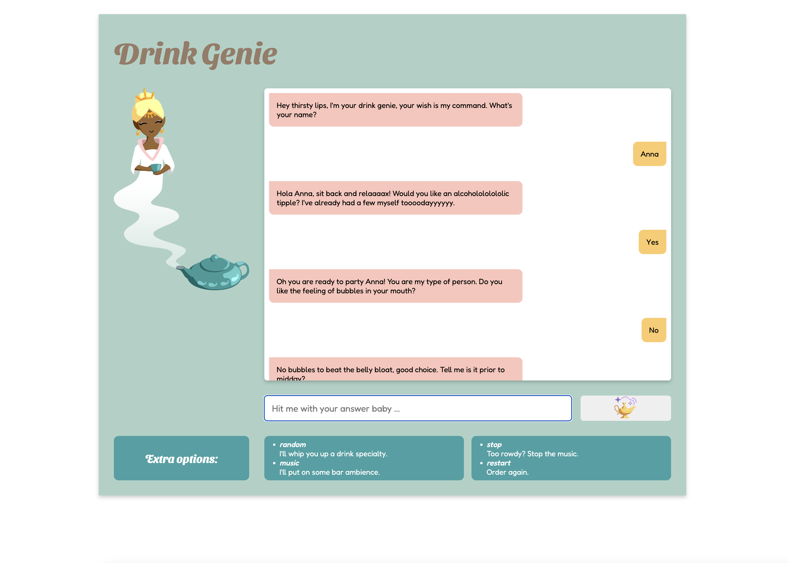

# 01 Project - ChatBot - Drink Genie

This was a project for Developers Institute.  Boilerplate code was provided.  I coded the logic for the conditional paths and all CSS to style the chatbot. 

The chatbot, or Drink Genie, will start by asking the user their name, which will enable the Drink Genie to personalise the rest of the responses. The Drink Genie will ask the user about a specific preference related to drinking or their current feelings, and the user will answer one of two options. The user's answer will trigger the Drink Genie to ask another question, based on the previous answer. The user will continue to provide responses to each question until the chatbot eventually provides the customer with a drink that best suits them. 

The Drink Genie will recognise if the user doesn't enter one of the required answers at each stage, letting them know that they need to try and enter their answer correctly again. 

The chatbot will also respond to four instructions from the customer at any stage during the conversation. The first instruction will be to provide the customer with a random drink choice.  The second instruction will be to restart the chatbot to the start. The third instruction will be to play music. The fourth instruction will be to stop the music. 

## Screenshot of ChatBot

## Dev dependencies

- [Prettier](https://prettier.io/)
- [Stylelint](https://stylelint.io/)
- [ESLint](https://eslint.org/)
- [Jest](https://jestjs.io/)

## Deployed applications

- [Drink Genie Chatbot](https://drinkgenie.netlify.app/)
