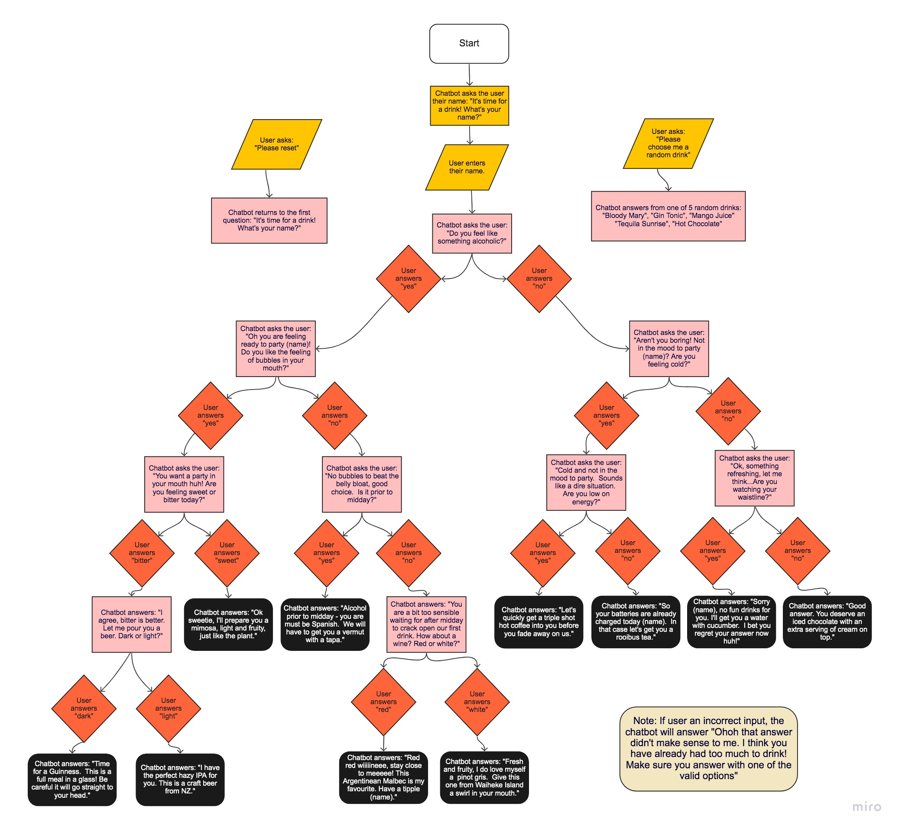

# "Join me for a drink" chatbot

## Problem statement


Create a chatbot that helps the customer decide which drink to order. Use the provided flowchart to build the chatbot.

The chatbot, or virtual barman, will start by asking the user their name, which will enable the chatbot to personalise the rest of the responses. The virtual barman will ask the user about a specific preference related to drinking or their current feelings, and the user will answer one of two options. The user's answer will trigger the chatbot to ask another question, based on the previous answer. The user will continue to provide responses to each question until the chatbot eventually provides the customer with a drink that best suits them. 

The chatbot will recognise if the user doesn't enter one of the required answers at each stage, letting them know that they need to try and enter their answer correctly again. 

The chatbot will also respond to two instructions from the customer at any stage during the conversation. The first instruction will be to provide the customer with a random drink choice.  The second instruction will be to reset the chatbot to the start. 

## Inputs, processes and outputs


* **Inputs:** ```msg```
* **Processes:** 
  * determine the correct answer based on the ```msg```, and previous inputs
  * process an instruction to reset the chatbot to the start
  * process an instruction to output a random answer
* **Output:** 
  * the next question, or answer to the question
  * reset the chatbot
  * a random drink option
  * an answer that tells the user to re-enter their ```msg``` correctly

--------------



-----------------
## Test scenarios

**Test 1**

* Start: "It's time for a drink! What's your name?"
* Input: ````${name}````
* Output: "Do you feel like something alcoholic?"
* Input: "yes"
* Output: "Oh you are feeling ready to party ````${name}````! Do you like the feeling of bubbles in your mouth?"
* Input: "yes"
* Output: "You want a party in your mouth huh! Are you feeling sweet or bitter today?"
* Input: "bitter"
* Output: "I agree, bitter is better. Let me pour you a beer. Dark or light?"
* Input: "dark"
* Output: "Time for a Guinness.  This is a full meal in a glass! Be careful it will go straight to your head."
  
**Test 2**  

* Start: "It's time for a drink! What's your name?"
* Input: ````${name}````
* Output: "Do you feel like something alcoholic?"
* Input: "no"
* Output: "Aren't you boring! Not in the mood to party ````${name}````? Are you feeling cold?"
* Input: "yes"
* Output: "Cold and not in the mood to party.  Sounds like a dire situation.  Are you low on energy?"
* Input: "no"
* Output: "So your batteries are already charged today ````${name}````.  In that case let's get you a rooibus tea."

**Test 3**

* Input: "hello bot"
* Output: "Ohoh that answer didn't make sense to me. I think you have already had too much to drink! Make sure you answer with one of the valid options"

**Test 4**

* Input: "Please reset the order"
* Output: "It's time for a drink! What's your name?"

**Test 5**

* Input: "Please select a random drink for me"
* Output: "Bloody Mary"