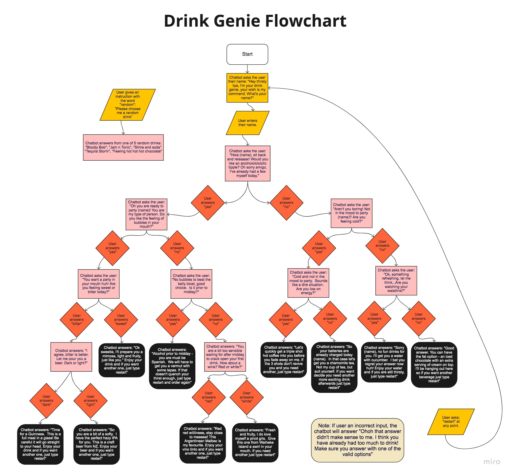

# "Drink Genie" chatbot

## Problem statement


Create a chatbot that helps the customer decide which drink to order. Use the provided flowchart to build the chatbot.

The chatbot, or Drink Genie, will start by asking the user their name, which will enable the Drink enie to personalise the rest of the responses. The Drink Genie will ask the user about a specific preference related to drinking or their current feelings, and the user will answer one of two options. The user's answer will trigger the Drink Genie to ask another question, based on the previous answer. The user will continue to provide responses to each question until the chatbot eventually provides the customer with a drink that best suits them. 

The Drink Genie will recognise if the user doesn't enter one of the required answers at each stage, letting them know that they need to try and enter their answer correctly again. 

The chatbot will also respond to two instructions from the customer at any stage during the conversation. The first instruction will be to provide the customer with a random drink choice.  The second instruction will be to restart the chatbot to the start. 

## Inputs, processes and outputs


* **Inputs:** ```msg```
* **Processes:** 
  * determine the correct answer based on the ```msg```, and previous inputs
  * process an instruction to reset the chatbot to the start
  * process an instruction to output a random answer
* **Output:** 
  * the next question, or answer to the question
  * restart the chatbot
  * a random drink option
  * an answer that tells the user to re-enter their ```msg``` correctly

--------------



-----------------
## Test scenarios

**Path for checking name**

* Start: "Hey thirsty lips, I'm your drink genie, your wish is my command. What's your name?"
* Input: Bob
* Output: "Hola Bob, sit back and relaaaax! Would you like an alcoholololololic tipple? I've already had a few myself toooodayyyyyy."
  
**Path for guinness**

* Start: "Hey thirsty lips, I'm your drink genie, your wish is my command. What's your name?"
* Input: Bob
* Output: "Hola Bob, sit back and relaaaax! Would you like an alcoholololololic tipple? I've already had a few myself toooodayyyyyy."
* Input: "yes"
* Output: "Oh you are ready to party Bob! You are my type of person. Do you like the feeling of bubbles in your mouth?"
* Input: "yes"
* Output: "You want a party in your mouth huh! Are you feeling sweet or bitter today?"
* Input: "bitter"
* Output: "I agree, bitter is better. Let me pour you a beer. Dark or light?"
* Input: "dark"
* Output: "Time for a Guinness.  This is a full meal in a glass! Be careful it will go straight to your head. Enjoy your drink and if you want another one, just type restart."

**Path for Hazy IPA**

* Start: "Hey thirsty lips, I'm your drink genie, your wish is my command. What's your name?"
* Input: Bob
* Output: "Hola Bob, sit back and relaaaax! Would you like an alcoholololololic tipple? I've already had a few myself toooodayyyyyy."
* Input: "yes"
* Output: "Oh you are ready to party Bob! You are my type of person. Do you like the feeling of bubbles in your mouth?"
* Input: "yes"
* Output: "You want a party in your mouth huh! Are you feeling sweet or bitter today?"
* Input "bitter"
* Output: "I agree, bitter is better. Let me pour you a beer. Dark or light?"
* Input: "light"
* Output: "So you are a bit of a softie. I have the perfect hazy IPA for you. This is a craft beer from NZ. Enjoy your beer and if you want another drink, just type restart."

**Path for Mimosa**

* Start: "Hey thirsty lips, I'm your drink genie, your wish is my command. What's your name?"
* Input: Bob
* Output: "Hola Bob, sit back and relaaaax! Would you like an alcoholololololic tipple? I've already had a few myself toooodayyyyyy."
* Input: "yes"
* Output: "Oh you are ready to party Bob! You are my type of person. Do you like the feeling of bubbles in your mouth?"
* Input: "yes"
* Output: "You want a party in your mouth huh! Are you feeling sweet or bitter today?"
* Input: "sweet"
* Output: "Ok sweetie I'll prepare you a mimosa, light and fruity just like you. Enjoy your drink and if you want another one, just type restart."

**Path for vermut**

* Start: "Hey thirsty lips, I'm your drink genie, your wish is my command. What's your name?"
* Input: Mary
* Output: "Hola Mary, sit back and relaaaax! Would you like an alcoholololololic tipple? I've already had a few myself toooodayyyyyy."
* Input: "yes"
* Output: "Oh you are ready to party Mary! You are my type of person. Do you like the feeling of bubbles in your mouth?"
* Input: "no"
* Output: "No bubbles to beat the belly bloat, good choice. Tell me is it prior to midday?"
* Input "yes"
* Output: "Alcohol prior to midday - you must be Spanish! We will have to get you a vermut with some tapas. If that doesn't quench your thirst enough, just type restart and order again."

**Path for red wine**

* Start: "Hey thirsty lips, I'm your drink genie, your wish is my command. What's your name?"
* Input: Mary
* Output: "Hola Mary, sit back and relaaaax! Would you like an alcoholololololic tipple? I've already had a few myself toooodayyyyyy."
* Input: "yes"
* Output: "Oh you are ready to party Mary! You are my type of person. Do you like the feeling of bubbles in your mouth?"
* Input: "no"
* Output: "No bubbles to beat the belly bloat, good choice. Tell me is it prior to midday?"
* Input "no"
* Output: "You are a bit too sensitive waiting until after midday to crack open your first drink.  Let's go with a wine - red or white?"
* Input: "red"
* Output: "Red red wiiiiineee, stay close to meeeee! This Argentinean Malbec is my favourite. Enjoy your vino tinto and if you want another one, just type restart."

**Path for white wine**

* Start: "Hey thirsty lips, I'm your drink genie, your wish is my command. What's your name?"
* Input: Mary
* Output: "Hola Mary, sit back and relaaaax! Would you like an alcoholololololic tipple? I've already had a few myself toooodayyyyyy."
* Input: "yes"
* Output: "Oh you are ready to party Mary! You are my type of person. Do you like the feeling of bubbles in your mouth?"
* Input: "no"
* Output: "No bubbles to beat the belly bloat, good choice. Tell me is it prior to midday?"
* Input "no"
* Output: "You are a bit too sensitive waiting until after midday to crack open your first drink.  Let's go with a wine - red or white?"
* Input: "white"
* Output: "Fresh and fruity, I do love myself a pinot gris.  Give this one from Waiheke Island a swirl in your mouth. If you need another just type restart."

**Path for coffee**  

* Start: "Hey thirsty lips, I'm your drink genie, your wish is my command. What's your name?"
* Input: "Anna"
* Output: "Hola Anna, sit back and relaaaax! Would you like an alcoholololololic tipple? I've already had a few myself toooodayyyyyy."
* Input: "no"
* Output: "Aren't you boring! Not in the mood to party Anna? Are you feeling cold?"
* Input: "yes"
* Output: "Cold and not in the mood to party.  Sounds like a dire situation.  Are you low on energy?"
* Input: "yes"
* Output: "Let's quickly get a triple shot hot coffee into you before you fade away on me. If the 3 shots don't revive you and you need another, just type restart."

**Path for chamomile tea**  

* Start: "Hey thirsty lips, I'm your drink genie, your wish is my command. What's your name?"
* Input: "Anna"
* Output: "Hola Anna, sit back and relaaaax! Would you like an alcoholololololic tipple? I've already had a few myself toooodayyyyyy."
* Input: "no"
* Output: "Aren't you boring! Not in the mood to party Anna? Are you feeling cold?"
* Input: "yes"
* Output: "Cold and not in the mood to party.  Sounds like a dire situation.  Are you low on energy?"
* Input: "no"
* Output: "So your batteries are already charged today Anna.  In that case let's get you a chamomile tea. Not my cup of tea, but suit yourself. If you want decide you need another more exciting drink afterwards just type restart."

**Path for water with cucumber**  

* Start: "Hey thirsty lips, I'm your drink genie, your wish is my command. What's your name?"
* Input: "Anna"
* Output: "Hola Anna, sit back and relaaaax! Would you like an alcoholololololic tipple? I've already had a few myself toooodayyyyyy."
* Input: "no"
* Output: "Aren't you boring! Not in the mood to party Anna? Are you feeling cold?"
* Input: "no"
* Output: "Ok, something refreshing, let me think...Are you watching your waistline?"
* Input: "yes"
* Output: "Sorry Anna, no fun drinks for you. I'll get you a water with cucumber.  I bet you regret your answer now huh! Enjoy your water and if you are still thirsty, just type restart."

**Path for iced chocolate**  

* Start: "Hey thirsty lips, I'm your drink genie, your wish is my command. What's your name?"
* Input: "Anna"
* Output: "Hola Anna, sit back and relaaaax! Would you like an alcoholololololic tipple? I've already had a few myself toooodayyyyyy."
* Input: "no"
* Output: "Aren't you boring! Not in the mood to party Anna? Are you feeling cold?"
* Input: "no"
* Output: "Ok, something refreshing, let me think...Are you watching your waistline?"
* Input: "no"
* Output: "Good answer. You can have the fat option - an iced chocolate with an extra serving of cream on top. I'll be hanging out here so if you want another beverage just type restart."

**Path for restart**

* Start: "Hey thirsty lips, I'm your drink genie, your wish is my command. What's your name?"
* Input: "Bob"
* Output: "Hola Bob, sit back and relaaaax! Would you like an alcoholololololic tipple? I've already had a few myself toooodayyyyyy."
* Input: "restart"
* Output: "Hey thirsty lips, I'm your drink genie, your wish is my command. What's your name?"
* * Input: "Anna"
* Output: "Hola Anna, sit back and relaaaax! Would you like an alcoholololololic tipple? I've already had a few myself toooodayyyyyy."

**Path for random command**

* Start: "Hey thirsty lips, I'm your drink genie, your wish is my command. What's your name?"
* Input: "Anna"
* Output: "Hola Anna, sit back and relaaaax! Would you like an alcoholololololic tipple? I've already had a few myself toooodayyyyyy."
* Input: "random"
* Output: "Bloody Bob"
  
**Path for incoherent answer**

* Start: "Hey thirsty lips, I'm your drink genie, your wish is my command. What's your name?"
* Input: "Bob"
* Output: "Hola Bob, sit back and relaaaax! Would you like an alcoholololololic tipple? I've already had a few myself toooodayyyyyy."
* Input: "really?"
* Output: "Ohoh that answer didn't make sense to me. I think you have already had too much to drink! Make sure you answer with one of the valid options or type restart."

**Path for yes variations**

* Start: "Hey thirsty lips, I'm your drink genie, your wish is my command. What's your name?"
* Input: Bob
* Output: "Hola Bob, sit back and relaaaax! Would you like an alcoholololololic tipple? I've already had a few myself toooodayyyyyy."
* Input: "YEAH"
* Output: "Oh you are ready to party Bob! You are my type of person. Do you like the feeling of bubbles in your mouth?"
* Input: "Y"
* Output: "You want a party in your mouth huh! Are you feeling sweet or bitter today?"
* Input: "bitter"
* Output: "I agree, bitter is better. Let me pour you a beer. Dark or light?"
* Input: "Dark"
* Output: "Time for a Guinness.  This is a full meal in a glass! Be careful it will go straight to your head. Enjoy your drink and if you want another one, just type restart."

**Path for no variations**  

* Start: "Hey thirsty lips, I'm your drink genie, your wish is my command. What's your name?"
* Input: "Anna"
* Output: "Hola Anna, sit back and relaaaax! Would you like an alcoholololololic tipple? I've already had a few myself toooodayyyyyy."
* Input: "Nup"
* Output: "Aren't you boring! Not in the mood to party Anna? Are you feeling cold?"
* Input: "yes"
* Output: "Cold and not in the mood to party.  Sounds like a dire situation.  Are you low on energy?"
* Input: "N"
* Output: "So your batteries are already charged today Anna.  In that case let's get you a chamomile tea. Not my cup of tea, but suit yourself. If you want decide you need another more exciting drink afterwards just type restart."

**Path for jukebox and stop commands**

* Start: "Hey thirsty lips, I'm your drink genie, your wish is my command. What's your name?"
* Input: "Bob"
* Output: "Hola Bob, sit back and relaaaax! Would you like an alcoholololololic tipple? I've already had a few myself toooodayyyyyy."
* Input: "jukebox"
* Output: "Here is a bit of bar ambience.  If it gets too noisy, just type stop at anytime. Let's continue with your drink order...what was your answer to my last question? Otherwise type restart and we can order again from scratch."
* Input: "no"
* Output: "Aren't you boring! Not in the mood to party Bob? Are you feeling cold?"
* Input: "stop"
* Output: "I agree that it got pretty noisy in here! Let's continue with your drink order...what was your answer to my last question? Otherwise type restart and we can order again from scratch."
* Input: "yes"
* Output: "Cold and not in the mood to party.  Sounds like a dire situation.  Are you low on energy?"
