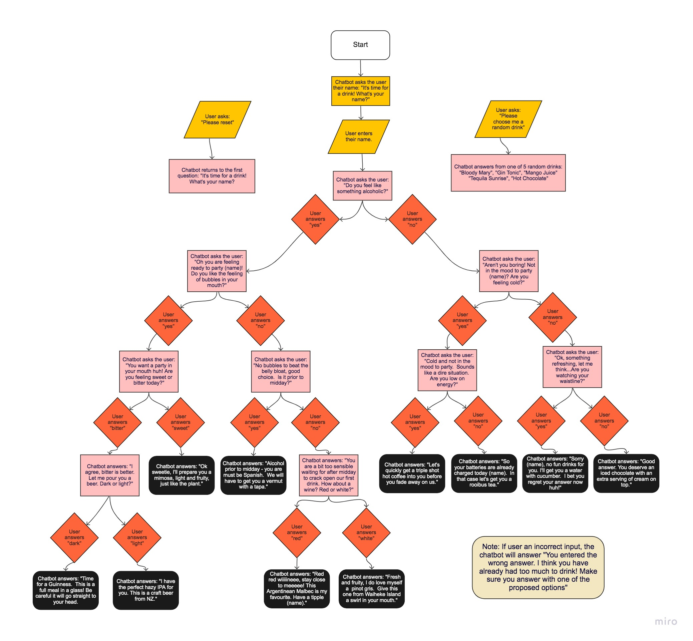

# "Join me for a drink" chatbot

## Problem statement

Create a chatbot that helps the customer decide which drink to order. Use the provided flowchart to build the chatbot.

The chatbot, or virtual barman, will start by asking the user their name, which will enable the chatbot to personalise the rest of the responses. The virtual barman will ask the user about a specific preference related to drinking or their current feelings, and the user will answer one of two options. The user's answer will trigger the chatbot to ask another question, based on the previous answer. The user will continue to provide responses to each question until the chatbot eventually provides the customer with a drink that best suits them. 

The chatbot will recognise if the user doesn't enter one of the required answers at each stage, letting them know that they need to try and enter their answer correctly again. 

The chatbot will also respond to two instructions from the customer at any stage during the conversation. The first instruction will be to provide the customer with a random drink choice.  The second instruction will be to reset the chatbot to the start. 

## Inputs, processes and outputs

* **Inputs:** ```msg```
* **Processes:** determine the correct answer based on the msg, and previous inputs
* **Output:** the next question, or answer to the question




## Test scenarios


Input: "yeah"
Output: "Please enter yes or no"